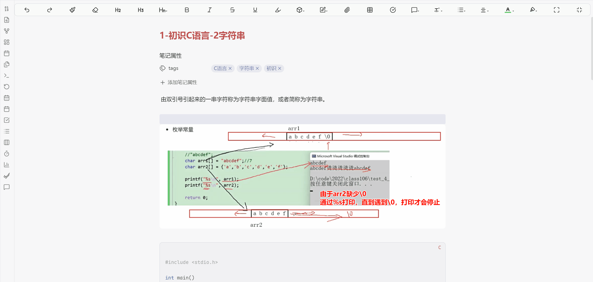
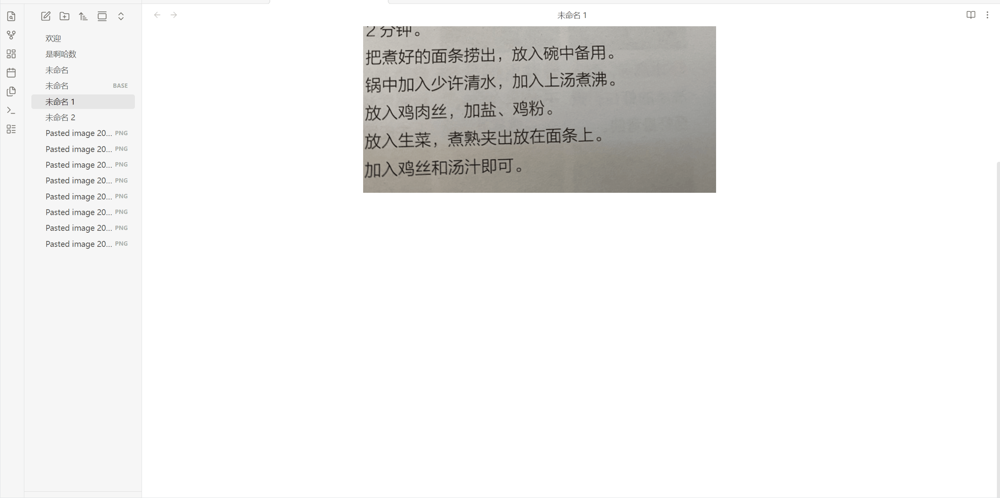

# 🔍 Obsidian OCR Global Search (全库本地图片搜索)

> **让你的图片“开口说话”。基于微信本地 OCR 引擎的 Obsidian 全库图片搜索引擎。** *Make your images searchable. A local, privacy-focused global search engine for Obsidian based on WeChat OCR.*

## 📖 简介 (Introduction)

**Obsidian Local OCR Search** 是一款旨在解决“图片内容无法搜索”痛点的插件。它在后台默默为你的图片库建立索引，让你能够像搜索笔记一样搜索图片中的文字。

不同于普通的 OCR 插件，它专注于**检索与可视化**体验：

- 🔍 **全局搜索**：输入关键词，瞬间找到包含该文字的所有图片。
- 🎯 **可视化定位**：在预览图中，使用**蓝色呼吸框**精准圈出文字所在位置，一目了然。
- 🔗 **溯源跳转**：忘记这张图在哪篇笔记里用了？插件底部会自动列出所有引用来源，点击即可**精准跳转到笔记中的对应行**。

------

## ✨ 核心特性 (Features)

- **🔒 隐私第一**：所有 OCR 识别均在本地运行（依赖微信本地引擎），无数据上传，安全可靠。
- **⚡ 极速检索**：基于本地索引（Index），搜索结果毫秒级响应。
- **👀 分栏预览**：左侧显示搜索结果列表，右侧实时预览图片大图。
- **🔦 智能高亮**：
  - **蓝色呼吸框**：在图片上直接圈出匹配文字的位置。
  - **文字高亮**：在左侧列表中高亮显示匹配的文字片段。
- **📍 双向链接**：
  - 双击图片：直接在 Obsidian 中打开图片文件。
  - 点击底部引用：直接打开引用该图片的笔记，并**自动滚动到图片所在位置**。

------

## ⚠️ 前置要求 (Prerequisites)

**本插件是客户端，必须配合 Python 服务端才能工作！**

在安装本插件之前，请务必下载并运行配套的 OCR 服务端：

👉 **[服务端下载: WeChat-Local-OCR-Serve](https://github.com/zhywjml/WeChat-Local-OCR-Serve)**

*(请确保 `WeChatOCR_Server.exe` 已启动，且右下角托盘图标可见)*

------

## 📥 安装方法 (Installation)

### 手动安装 (推荐)

1. 下载本仓库的 `main.js`, `manifest.json`, `styles.css`。
2. 在你的 Obsidian 仓库中创建文件夹：`.obsidian/plugins/wechat-ocr-search/`。
3. 将文件放入该文件夹。
4. 在 Obsidian **设置** -> **第三方插件** 中启用 `WeChat OCR Global Search`。

------

## 🎮 使用指南 (Usage)

### 1. 首次使用：建立索引

插件首次启用时会自动扫描图片，但建议手动触发一次以确保数据完整：

1. 按 `Ctrl/Cmd + P` 打开命令面板。
2. 输入并执行命令：**`WeChat OCR: 🔄 重建图片索引 (Rebuild Index)`**。
3. 观察 Obsidian 右下角状态栏，等待进度条跑完（显示 `🖼️ OCR 索引: xxx`）。

### 2. 执行搜索

1. 按 `Ctrl/Cmd + P` 打开命令面板。
2. 输入并执行命令：**`WeChat OCR: 🔍 全局搜索图片文字 (Visual Search)`**。
3. 在弹出的窗口中输入关键词（如“发票”、“报错”、“快递”）。
4. **点击**左侧结果，右侧查看图片及高亮位置。

### 3. 跳转引用 (溯源)

如果在右侧预览区的底部看到 **`🔗 引用来源:`** 栏：

- 这意味着该图片被一篇或多篇笔记引用了。
- **点击文件名**（如 `📄 工作日报`），插件会自动关闭搜索窗口，打开那篇笔记，并**直接跳转**到图片所在的那一行。

------

## 📸 效果演示 (Screenshots)

### 搜索功能与跳转笔记演示

### 添加新图片->自动建立索引->搜索演示

### 双击图片->新标签页打开图片演示

------

## ❓ 常见问题 (FAQ)

**Q: 搜索不到图片？** A: 请确保服务端正在运行，并尝试执行 `🔄 重建图片索引` 命令。

**Q: 索引数据存在哪里？** A: 数据存储在插件目录下的 `data.json` 文件中。它只包含文件名、修改时间和 OCR 文字及坐标，**不包含**图片本身，非常轻量。

**Q: 支持哪些图片格式？** A: 目前支持 `png`, `jpg`, `jpeg`, `bmp`。

------

## ⚖️ 开源协议 (License)

本项目基于 [MIT License](https://www.google.com/search?q=LICENSE) 开源。

------

**Made with ❤️ by [zhywjml](https://www.google.com/search?q=https://github.com/zhywjml)**
